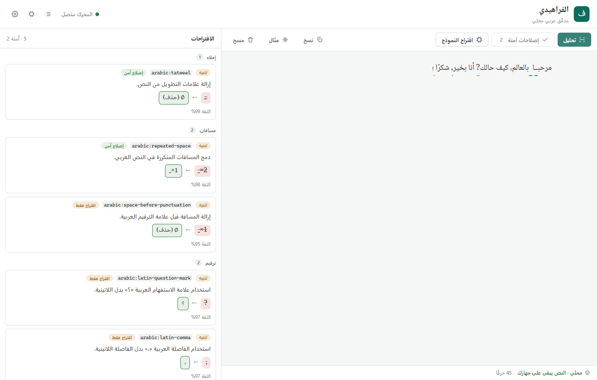

# Alfaraheedi

[](https://github.com/GalaxyRuler/alfaraheedi/actions/workflows/ci.yml)
[](https://github.com/GalaxyRuler/alfaraheedi/releases)
[](#data-and-licensing)

## What It Is

Alfaraheedi is an early Rust-native, local-first writing checker focused on high-precision safe corrections and correct Unicode offsets. The current rule set focuses on Arabic writing support, and it is not yet a full grammar checker.

The current MVP provides a shared Rust engine, a local CLI, an Axum JSON API, a local web workbench, opt-in local LLM suggestions, Docker runtime support, Windows packaging, and a small release eval gate. The v0.5 release adds a packaged Windows companion that checks text selected in other apps through an explicit hotkey flow. The v0.7 browser-extension foundation adds local-first editable web-field checking with accessibility guardrails for panel semantics, text direction, contrast, and Windows forced-colors mode. It is designed to keep user text on the user's machine by default.



## What It Is Not

Alfaraheedi is not a hosted writing service, an LSP server, a spell checker, an Arabic morphology engine, or an English grammar checker. The desktop companion does not provide live underlines in every app yet, and the browser-extension work is still an unpacked v0.7 foundation rather than a store-ready extension. It does not bundle corpora, dictionaries, model weights, or non-commercial datasets.

## Current Rules

The current Arabic rule set is intentionally small:

| Rule source | Status | Behavior |
| --- | --- | --- |
| `arabic:tatweel` | Safe auto-apply | Removes tatweel elongation marks. |
| `arabic:repeated-space` | Safe auto-apply | Collapses repeated spaces in Arabic text. |
| `arabic:latin-comma` | Suggest-only | Suggests Arabic comma punctuation in Arabic context. |
| `arabic:latin-question-mark` | Suggest-only | Suggests Arabic question mark punctuation in Arabic context. |
| `arabic:latin-semicolon` | Suggest-only | Suggests Arabic semicolon punctuation in Arabic context. |
| `arabic:space-before-punctuation` | Suggest-only | Suggests removing a space before Arabic punctuation. |
| `arabic:space-after-punctuation` | Suggest-only | Suggests adding a missing space after Arabic punctuation. |
| `arabic:conversational-greeting` | Suggest-only | Suggests a complete rewrite for a narrow `كيف حال ما اخبار`-style greeting. |

Safe auto-apply rules are eligible for `writecheck fix --safe`. Suggest-only rules are reported but not applied automatically.

The current English support is also narrow and deterministic:

| Rule source | Status | Behavior |
| --- | --- | --- |
| `english:common-typo` | Safe auto-apply | Corrects a small built-in set of common typos such as `helo` and `wat`. |
| `english:you-are-do` | Safe auto-apply | Corrects `you are do` to `are you doing`. |

## Install And Build

Install a current Rust toolchain, then build and test from the repository root:

```powershell
cargo build --workspace
cargo test --workspace
```

The release gate also expects:

```powershell
cargo fmt --all --check
cargo clippy --workspace -- -D warnings
cargo deny check licenses bans sources
```

## CLI Usage

Check a file and print JSON suggestions:

```powershell
cargo run -p write-cli -- check --format json path\to\file.txt
```

Apply only safe fixes and print the fixed text:

```powershell
cargo run -p write-cli -- fix --safe path\to\file.txt
```

Write safe fixes to a separate file:

```powershell
cargo run -p write-cli -- fix --safe path\to\file.txt --output path\to\fixed.txt
```

Run the local API server through the CLI:

```powershell
cargo run -p write-cli -- serve --addr 127.0.0.1:3000
cargo run -p write-cli -- serve --addr 127.0.0.1:3000 --frontend-dir frontend\dist
```

Inspect the optional local LLM policy and CPU model candidates:

```powershell
cargo run -p write-cli -- llm status
cargo run -p write-cli -- llm status --format json
cargo run -p write-cli -- llm doctor
cargo run -p write-cli -- llm doctor --format json
cargo run -p write-cli -- llm suggest path\to\file.txt
```

CLI smoke test:

```powershell
.\scripts\smoke-cli.ps1
```

## API Usage

The API exposes the same default rule set as the CLI.

```http
GET  /healthz
GET  /v1/health
GET  /v1/rules
GET  /v1/llm/status
POST /v1/llm/suggest
POST /v1/analyze
POST /v1/apply
```

Analyze text:

```powershell
$body = @{ text = "مرحبــا  بالعالم" } | ConvertTo-Json
Invoke-RestMethod -Uri http://127.0.0.1:3000/v1/analyze -Method Post -ContentType "application/json" -Body $body
```

Apply safe fixes:

```powershell
$body = @{ text = "مرحبــا  بالعالم"; mode = "safe" } | ConvertTo-Json
Invoke-RestMethod -Uri http://127.0.0.1:3000/v1/apply -Method Post -ContentType "application/json" -Body $body
```

API smoke test:

```powershell
.\scripts\smoke-api.ps1
```

## Web App

`frontend/` is a local-first writing workbench built with TypeScript, React, Vite, and CodeMirror 6. It talks to the local API and makes no telemetry, analytics, hosted LLM, or external service calls at runtime.

Run the API and web app with one command:

```powershell
.\scripts\dev.ps1
```

Or run the API and web app in two terminals:

```powershell
# Terminal 1
cargo run -p write-cli -- serve --addr 127.0.0.1:3000

# Terminal 2
cd frontend
npm install
npm run dev
```

During Vite development, the app defaults to `http://127.0.0.1:3000` for the API. Packaged builds default to the current app address, so alternate ports such as `3402` work without changing Settings. Draft persistence is off by default; enabling "Remember draft" stores text only in browser `localStorage`.

Frontend checks:

```powershell
cd frontend
npm run lint
npm run test
npm run build
npm run test:e2e
```

`npm run test:e2e` builds the frontend, starts `writecheck serve --frontend-dir frontend/dist`, and runs Playwright against the packaged local app in desktop and mobile Chromium.

## Desktop Companion

The v0.5 desktop companion is a Tauri Windows tray app. It is for text that already exists in another app: select text, press `Ctrl+Alt+A`, review local suggestions, then copy corrected text or replace the original selection.

The companion uses the clipboard only after the user invokes the hotkey or tray action. It attempts to restore the previous clipboard content after capture and replacement. It does not monitor raw text in the background, does not require `writecheck serve`, and does not send selected text to a hosted service.

In the v0.6 track, the companion can also call an optional local OpenAI-compatible LLM runtime from Settings. Configure the loopback runtime URL, model id, and timeout, then use "Check runtime" or "Run doctor" before requesting an "LLM suggestion" for the captured selection. The request shows progress and can be cancelled if the local runtime stalls. The app still does not bundle model weights, and LLM suggestions remain manual/suggestion-only.

The v0.7 browser-extension foundation lives in `browser-extension/`. It is a Chrome Manifest V3 extension for editable web fields. This foundation currently uses the local HTTP API bridge (`cargo run -p write-cli -- serve`), shows a compact suggestions panel near the active editor, renders scroll- and layout-synchronized non-mutating wavy underline overlays for textarea fields and safe text-like inputs (`text`, `search`, `email`, `url`, and `tel`), renders CSS Highlight marks for simple contenteditable fields where supported, and can apply an individual suggestion when the current field still contains the original text. The panel exposes region semantics for assistive tech, gives Apply buttons unique replacement-specific accessible labels while keeping the visible label compact, sets `dir="auto"` on panel, source, and replacement text for mixed Arabic/English suggestions, shows stale or unanchored review suggestions without unsafe Apply controls, stays open when keyboard focus moves from the editor into the panel, clamps inside the viewport near right or bottom edge editors, reports stale Apply attempts when the underlying text no longer matches, and can be dismissed with Escape. Injected panels and marks are cleared immediately after successful apply, editor text changes, focus loss, or editor removal; pending analysis is cancelled when focus leaves before debounce, analysis waits until browser IME/composition input ends before sending active editor text, and delayed API responses are ignored if the editor text changed while the request was in flight. It detects contenteditable `true`, empty, and `plaintext-only` tokens while ignoring read-only/disabled textarea/input controls, ARIA read-only/disabled editable controls, password inputs, sensitive-looking editable hints or ancestor containers such as one-time-code, credit-card, token, API-key, and secret fields, other non-text-like inputs, `contenteditable="false"` islands, hidden rich-editor decoration nodes, and known invisible rich-editor sentinel nodes such as Slate zero-width spans and ProseMirror trailing breaks. Matching frames get the content script, so iframe-hosted text controls can be handled, and open Shadow DOM text controls are detected through composed browser event paths. Non-editable, hidden, and sentinel rich-editor island text is omitted from analysis text and offset mapping, so guarded replacements after chips/widgets/placeholders can still land in the editable text. Anchored contenteditable replacements use DOM ranges so simple inline markup is preserved, and simple contenteditable `<br>`, repeated `<br>`, empty block, and common block-element line breaks are analyzed as newlines so suggestion offsets remain aligned. Plain textarea/input replacements also prefer validated spans, so accepting a later suggestion in repeated text does not rewrite the first matching word; accepted replacements place the caret after the inserted text and dispatch a composed `InputEvent` with `inputType="insertReplacementText"` so page frameworks and open Shadow DOM hosts can observe the edit. Runtime analyze requests preserve the editor text exactly, including surrounding whitespace, so those spans stay aligned; oversized editor text is refused locally with a status message before it reaches the extension runtime/API, and runtime/API failure messages shown in the page are sanitized so raw exception strings, URLs, and editor text are not reflected back into web content. The extension options page stores a loopback API URL, default writing mode, and an enabled/paused switch in browser extension storage, so non-default local API ports such as `3402` can be used without editing source files; the toolbar popup shows those saved settings, checks the configured `/v1/health` endpoint, and can pause or resume checking without sending editor text while paused. Build the upload zip with `.\scripts\package-browser-extension.ps1`; the package keeps API host permissions loopback-only and includes only runtime extension files plus manifest-declared PNG icons. It does not yet provide live production-editor-specific integration for Gmail, WhatsApp Web, Google Docs, or a packaged desktop bridge.

Before public browser-store release, use `browser-extension/MANUAL_RELEASE_GATES.md` and `.\scripts\new-browser-extension-manual-qa-report.ps1` to complete the live production-editor, manual screen-reader, public privacy URL, and store-dashboard checks. The report generator writes under `dist\browser-extension-manual-qa\` so private manual QA notes stay out of source control by default.

Use `.\scripts\get-browser-extension-release-readiness.ps1` to summarize the
local extension package, store-submission bundle, selected screenshots, manual
QA report template, public privacy URL status, and remaining account-side
blockers before store upload.

The v0.8 Office add-ins foundation lives in `office-addins/`. It is an
add-in-only XML manifest plus a Word/PowerPoint task pane for selected text:
read the current Office selection through Office.js, analyze it through the
local Alfaraheedi loopback API, and replace the selection with deterministic
safe fixes. Package it with `.\scripts\package-office-addins.ps1` and validate
the foundation with `.\scripts\validate-office-addins-release.ps1`. This does
not yet include the required local HTTPS task-pane host, sideload QA, Office
store submission, or live underline behavior.

Build the desktop app from `frontend/`:

```powershell
npm run desktop:build
```

For v0.5 releases, the recommended user artifact is a Windows installer named like `Alfaraheedi-0.5.0-windows-x64-setup.exe`. The CLI zip is a developer artifact, not the main install path.

## Docker

Build and run the local image:

```powershell
docker build -t alfaraheedi:local .
docker run -p 3000:3000 alfaraheedi:local
Invoke-RestMethod -Uri http://127.0.0.1:3000/healthz
```

Docker smoke test:

```powershell
.\scripts\smoke-docker.ps1
```

## Evaluation

The public MVP uses a small seed eval suite as a release gate for the currently shipped rules. It is not evidence of broad Arabic grammar coverage.

```powershell
cargo run -p write-eval
```

The command prints JSON, including rule-level metrics and explicit failure details, and exits non-zero on release-gating failures.

The eval gate reports both precision and recall. Missing expected rules count as false negatives and fail the release gate.

Reported false positives and false negatives can become public eval fixtures only after privacy review, reduction, or redaction. See `docs/evaluation.md` for the report-to-fixture checklist and metadata format.

## Feedback And Reporting

Please report false positives, false negatives, workbench UI bugs, packaging bugs, optional local LLM runtime issues, and docs issues through GitHub issues or the web workbench feedback report.

Do not paste private Arabic text, full documents, personal details, proprietary text, tokens, or URLs with private data into public issues. The workbench feedback report defaults to no raw text; include only a reduced public-safe example or selected span when it is necessary and safe.

Maintainer triage, patch-release criteria, and the report-to-eval-fixture process are documented in `docs/feedback-triage.md`.

## Privacy

Alfaraheedi is local-first by default. The CLI, API, Docker image, and eval tooling do not require sending text to a hosted service.

Project policy treats raw user text logging, retained analyzed text, and unredacted telemetry as privacy bugs. See `docs/privacy.md`.

## Data And Licensing

The code is licensed under `MIT OR Apache-2.0`. Code licenses and data licenses are tracked separately.

The repository does not bundle corpora, dictionaries, model weights, GPL-linked code, or non-commercial datasets. See `docs/model-data-policy.md`.

## Optional Local LLM

The local LLM track is suggestion-only. The built-in catalog currently points at CPU-capable GGUF candidates such as `qwen3-1.7b-q4_k_m`, but Alfaraheedi does not download or redistribute model weights by default. LLM output is not eligible for `fix --safe`.

The desktop companion can store local runtime settings under the app config directory. The runtime URL must be a loopback `http` or `https` URL such as `http://127.0.0.1:8000`; remote hosts are rejected. "Run doctor" checks policy, configuration, `/v1/models`, and a suggestion-only probe. After selecting text and opening the review window, use "LLM suggestion" to request a full-text suggestion, cancel the request if it takes too long, and apply it manually if it is useful.

Set `ALFARAHEEDI_LLM_BASE_URL` to an OpenAI-compatible local runtime before starting the API:

```powershell
$env:ALFARAHEEDI_LLM_BASE_URL = "http://127.0.0.1:8000"
$env:ALFARAHEEDI_LLM_MODEL = "qwen3-1.7b-q4_k_m"
cargo run -p write-cli -- serve --addr 127.0.0.1:3000
```

See `docs/local-llm.md`.

Smoke-test the optional LLM path:

```powershell
.\scripts\smoke-llm.ps1              # skips cleanly if no runtime is configured
.\scripts\smoke-llm.ps1 -MockRuntime # verifies the doctor and API contract with a local mock runtime
```

With a real OpenAI-compatible local runtime already running, set `ALFARAHEEDI_LLM_BASE_URL` and run `.\scripts\smoke-llm.ps1`.

## Download

Public release builds are published on the [GitHub Releases page](https://github.com/GalaxyRuler/alfaraheedi/releases). The current recommended Windows package is the desktop installer `Alfaraheedi-0.5.0-windows-x64-setup.exe`. The CLI/web zip remains available as an optional developer artifact.

## Packaging

Build the optional Windows x64 developer zip:

```powershell
.\scripts\package-windows.ps1 -Version 0.5.0
```

This legacy package includes `writecheck.exe`, `write-api.exe`, the built web app, docs, licenses, and `Start-Alfaraheedi.ps1`. For v0.5 user releases, prefer the desktop installer produced by `npm run desktop:build`.

## Roadmap

Near-term work after the public MVP:

- Broaden the release eval suite before promoting any new safe auto-apply rule.
- Add normalization checks only when reversible offset maps are proven.
- Keep dictionary and morphology work behind clear licensing and accuracy gates.
- v0.6: in-app local LLM setup and selected-text LLM suggestions.
- v0.7: browser extension for live web editor underlines.
- v0.8: Word and PowerPoint Office add-ins foundation, then sideload QA.
- v0.9: UI Automation pilot for supported Windows native text controls.
- Add LSP or hosted integrations only after the local engine contract is stable.

## Known Limitations

- Not a full Arabic grammar checker.
- No Arabic morphology or context-heavy grammar correction.
- No spell checking.
- No English grammar layer.
- No production Office add-in, UI Automation overlay, or LSP server.
- No live underlines everywhere in the desktop companion.
- No hosted service or telemetry pipeline.
- Current eval coverage is small and release-gate oriented.
